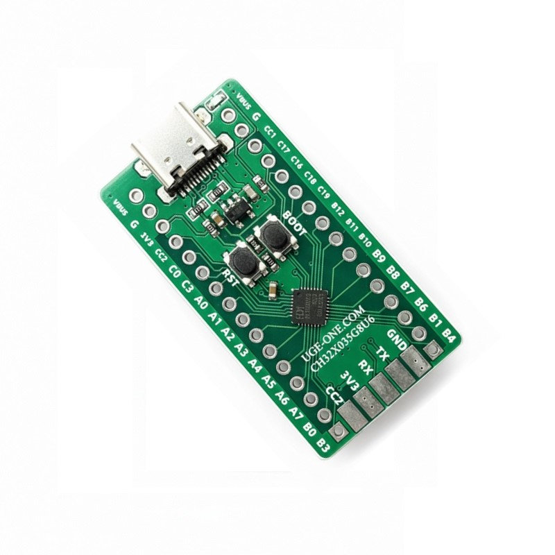
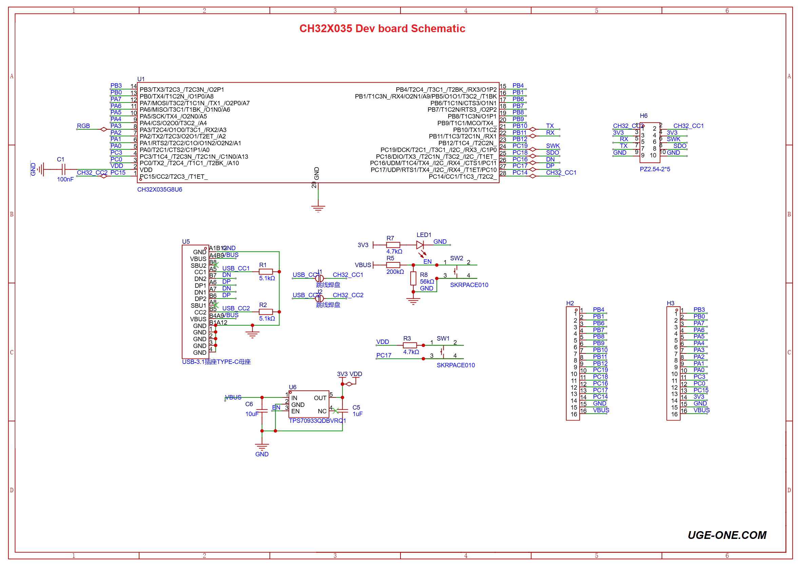

# CH32X035G8U6 USB-PD Development Board

Compact **32-bit QingKe RISC-V** development board based on the WCH **CH32X035G8U6**, with built-in **USB 2.0** and **USB Power Delivery / Type-C** PHY. This repository contains the board documentation, schematic, PCB artwork, and interactive BOM.

<p align="center">
  
</p>

Available as a **fully assembled board** or as an **empty PCB** for DIY soldering. It is intended for electronics enthusiasts, embedded developers, and students who need a small RISC-V MCU with native USB and USB-PD experimentation.

## Buy options

- Fully assembled board: [Buy here](https://uge-one.com/product/ch32x035g8u6-usb-pd-32-bit-risc-v-microcontroller-development-board/)
- Bare PCB for DIY soldering: [Buy here](https://uge-one.com/product/pcb-for-ch32x035g8u6-usb-pd-development-board/)

## Key features

- WCH **CH32X035G8U6** industrial-grade MCU (QingKe **RISC-V4C**, RV32IMAC)
- Built-in **USB 2.0 full-speed** controller and PHY (Host / Device)
- Built-in **USB-PD** and **Type-C** controller and PHY (Sink / Source / DRP, PPS)
- Onboard **USB Type-C** connector with **CC1 / CC2** broken out
- **BOOT** and **RST** push buttons
- Dual 16-pin GPIO rows — breadboard-friendly
- Edge pads for **UART (TX / RX)** and **2-wire debug (DIO / CLK)**
- Powered from USB Type-C **5 V**, onboard **3.3 V** LDO for the MCU
- Factory USB bootloader — flash without an external debugger
- Compact layout with labeled silkscreen (`UGE-ONE.COM`)

## Technical specifications

| Specification | Detail |
| --- | --- |
| MCU | CH32X035G8U6 (QFN-28) |
| Core | QingKe RISC-V4C, RV32IMAC, up to **48 MHz** |
| Memory | **62 KB** Flash, **20 KB** SRAM |
| USB | USB 2.0 FS Host/Device + integrated PHY |
| USB-PD / Type-C | Built-in PD + Type-C PHY (Sink / Source / DRP, PPS) |
| Supply | USB Type-C **5 V** in → onboard **3.3 V** regulation |
| Logic level | **3.3 V** GPIO |
| Buttons | BOOT, RST |
| Headers | 2 × 16-pin GPIO + 5-pad edge programming / UART |
| Board type | Fully assembled **or** bare PCB |

MCU electrical limits, PD roles, and peripheral details must be taken from the official [CH32X035 datasheet](https://www.wch-ic.com/downloads/CH32X035DS0_PDF.html) for the chip revision you use.

### Microcontroller highlights

- Single-cycle hardware multiply, hardware divide
- Operating voltage range **2.0 V – 5.5 V** (board runs the MCU at **3.3 V**)
- Low-power modes: sleep / stop / standby
- Programmable Protocol I/O Controller (**PIOC**)
- 8-channel DMA, 12-bit ADC, OPA/PGA, comparators, touch-key
- USART, I²C, SPI, advanced-control timers with complementary PWM
- 96-bit unique chip ID, serial 2-wire debug interface
- Factory built-in **USB bootloader**

## Pinout

Orientation: USB Type-C on the **left**. Silkscreen uses short port names (`A0` = PA0, `B10` = PB10, `C16` = PC16, `G` = GND).

### Top row (USB-C → opposite end)

| Pin | Function |
| --- | --- |
| VBUS | USB 5 V |
| G | Ground |
| CC1 | Type-C CC1 (MCU PC14) |
| C17 | PC17 (USB DP) |
| C16 | PC16 (USB DN) |
| C18 | PC18 (debug DIO / SWDIO) |
| C19 | PC19 (debug CLK / SWCLK) |
| B12 … B6, B1, B4 | GPIOs PB12–PB6, PB1, PB4 |

UART on the side pads maps to **TX = PB10**, **RX = PB11**.

### Bottom row (USB-C → opposite end)

| Pin | Function |
| --- | --- |
| VBUS | USB 5 V |
| G | Ground |
| 3V3 | Regulated 3.3 V |
| CC2 | Type-C CC2 (MCU PC15) |
| C0, C3 | PC0, PC3 |
| A0 … A7 | PA0–PA7 |
| B0, B3 | PB0, PB3 |

### Edge pads

| Top silkscreen | Bottom silkscreen | Use |
| --- | --- | --- |
| GND | GND | Ground |
| TX | DIO | UART TX (PB10) / shared with debug pad labeling on reverse |
| RX | CLK | UART RX (PB11) / shared with debug pad labeling on reverse |
| 3V3 | 3V3 | 3.3 V |
| CC2 | CC1 | Type-C CC lines |

Use a **WCH-LinkE** (RISC-V mode) on the 2-wire debug pads for SWD-style programming and debugging. Typical connection:

```
WCH-LinkE          Board
─────────          ─────
SWDIO / DIO   ↔    DIO (PC18)
SWCLK / CLK   →    CLK (PC19)
GND           →    GND
3V3           →    3V3
```

## Power

- Power the board from the **USB Type-C** connector (5 V on VBUS).
- Onboard LDO generates **3.3 V** for the MCU and `3V3` header pins.
- GPIO is **3.3 V** logic — do not drive pins with 5 V.
- The schematic includes **5.1 kΩ** CC pull-downs so the Type-C port presents as a **UFP / Sink** by default; change or override this in firmware/hardware when experimenting with Source or DRP roles.

## Schematic and BOM

<p align="center">
  
</p>

- Schematic: [`CH32X035 Schematic.png`](CH32X035%20Schematic.png) · also in [`IMGs/CH32X035_Schematic.png`](IMGs/CH32X035_Schematic.png)
- Interactive BOM (opens in the browser): [https://ugeelectronics.github.io/CH32X035G8U6-USB-PD-DevBoard/bom.html](https://ugeelectronics.github.io/CH32X035G8U6-USB-PD-DevBoard/bom.html)
- Interactive BOM source: [`PCB For CH32X035G8U6 USB PD Development Board Assembly Manual.html`](PCB%20For%20CH32X035G8U6%20USB%20PD%20Development%20Board%20Assembly%20Manual.html) (too large for GitHub’s file viewer; use the Pages link above)
- Bare PCB photo: [`IMGs/CH32X035G8U6_PCB_Top_Bottom.jpg`](IMGs/CH32X035G8U6_PCB_Top_Bottom.jpg)

## Programming and firmware

There are two practical ways to program the board.

### 1. Built-in USB bootloader

1. Disconnect the board from USB and other supplies.
2. Hold **BOOT**, plug USB Type-C into the PC, then release **BOOT**.
3. Upload firmware within a few seconds using WCH tools or open-source flashers.

| Tool | Notes |
| --- | --- |
| [WCHISPTool](https://www.wch-ic.com/downloads/WCHISPTool_Setup_exe.html) | Official Windows ISP tool |
| [chprog](https://pypi.org/project/chprog/) | Python CLI: `chprog firmware.bin` |

**Windows:** install the CH372 / ISP driver, or use [Zadig](https://zadig.akeo.ie/) (libusb-win32) while the chip is in bootloader mode.

**Linux udev** (bootloader VID/PID):

```bash
echo 'SUBSYSTEM=="usb", ATTR{idVendor}=="4348", ATTR{idProduct}=="55e0", MODE="666"' | sudo tee /etc/udev/rules.d/99-ch55x.rules
echo 'SUBSYSTEM=="usb", ATTR{idVendor}=="1a86", ATTR{idProduct}=="55e0", MODE="666"' | sudo tee -a /etc/udev/rules.d/99-ch55x.rules
sudo udevadm control --reload-rules
```

### 2. Serial 2-wire debug (WCH-LinkE)

Use a **WCH-LinkE** in **RISC-V** mode with [WCH-LinkUtility](https://www.wch-ic.com/downloads/WCH-LinkUtility_ZIP.html), [MounRiver Studio](http://www.mounriver.com/), or [rvprog](https://pypi.org/project/rvprog/) (`rvprog -f firmware.bin`).

## Library & development tools

| Resource | Link |
| --- | --- |
| Official IDE | [MounRiver Studio](http://www.mounriver.com/) |
| Chip datasheet | [CH32X035DS0](https://www.wch-ic.com/downloads/CH32X035DS0_PDF.html) |
| Reference manual | [CH32X035RM](https://www.wch-ic.com/downloads/CH32X035RM_PDF.html) |
| WCH EVT package | [CH32X035EVT.ZIP](https://www.wch.cn/downloads/CH32X035EVT_ZIP.html) |
| OpenWCH examples | [openwch/ch32x035](https://github.com/openwch/ch32x035) |
| Arduino core (community) | [openwch/arduino_core_ch32](https://github.com/openwch/arduino_core_ch32) |
| PlatformIO (community) | [Community CH32V platform](https://github.com/Community-PIO-CH32V/platform-ch32v) |
| Product page (MCU) | [CH32X035G8U6 on uge-one.com](https://uge-one.com/product/ch32x035g8u6-usb-microcontroller-with-pd-protocol-qfn28/) |

## Examples

Start from the official **CH32X035EVT** package or the [openwch/ch32x035](https://github.com/openwch/ch32x035) tree. Typical first projects:

| Example focus | What to try |
| --- | --- |
| Blink / GPIO | Drive a pin on the header (e.g. PB3) |
| USB CDC / HID | Native USB device without an external UART bridge |
| USB-PD | Negotiate power roles using the onboard PD PHY and CC lines |
| UART | TX/RX edge pads (PB10 / PB11) for serial console |
| ADC / timers | PA0–PA7 and timer pins on the dual headers |

Board-specific example sketches can be added under `examples/` in later revisions of this repo.

## Applications

- USB device development (CDC, HID, custom classes)
- USB-PD / Type-C Sink, Source, and DRP experiments
- Compact embedded controllers and IoT nodes
- RISC-V learning and teaching platforms
- Prototyping before designing a custom CH32X035 PCB

## Package contents

**Assembled board**

- 1 × CH32X035G8U6 USB-PD development board (fully assembled and tested)

**Bare PCB**

- 1 × empty PCB for DIY soldering (components not included)

USB cable and debugger are not included unless stated on the product page.

## Notes

- Install the correct USB / ISP drivers before using the bootloader on Windows.
- GPIO is **3.3 V** only.
- USB-PD behavior depends on firmware and the Type-C partner; verify Sink/Source/DRP requirements for your application.
- Intended for developers familiar with embedded firmware tooling (MounRiver Studio, WCHISPTool, or equivalent).

## Repository layout

```
.
├── README.md
├── CH32X035 Schematic.png
├── CH32X035G8U6 Dev Board.jpg
├── CH32X035G8U6 Dev Board1.jpg
├── CH32X035G8U6.jpg
├── PCB For CH32X035G8U6 USB PD Development Board.jpg
├── PCB For CH32X035G8U6 USB PD Development Board Assembly Manual.html
├── IMGs/                 Board photos and schematic copies for the README
├── site/                 GitHub Pages landing page (when enabled)
└── .github/workflows/    Pages deploy workflow (when enabled)
```

Repository: [UGEelectronics/CH32X035G8U6-USB-PD-DevBoard](https://github.com/UGEelectronics/CH32X035G8U6-USB-PD-DevBoard)

UG Electronics · [uge-one.com](https://uge-one.com)
